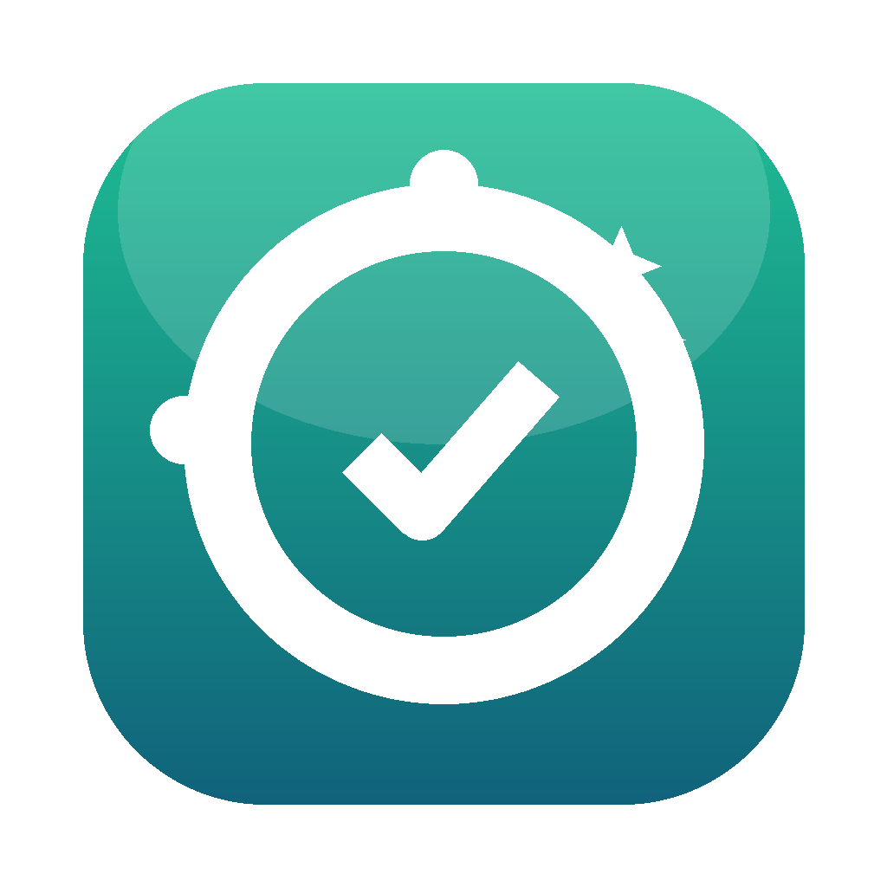

<div align="center">



# 🪽 KRYLAN · CleanMac

### «Дай устройству крылья»

**Красивый оптимизатор со «стеклянным» интерфейсом и фирменным анимированным глобусом.**
Дашборд с диаграммами, автопилот, безопасная очистка — мощнее CleanMyMac и CCleaner, бесплатно и с открытым кодом.

**Экосистема KRYLAN:** macOS · Windows · Linux · iPhone/iPad · Android — **все платформы доступны**.
**Создатель:** Кырлан Александр Сергеевич.

> **Только безопасное.** Без чистки реестра, без дефрага SSD, без fake-booster и обещаний «ускорим в 10 раз».
> Любое удаление — обратимо (Корзина / undo). Системное под защитой — решаешь ты.


</div>

---

## Возможности

Везде одна ДНК: **анимированный неон-глобус** (вращающаяся планета) на дашборде,
«стеклянный» интерфейс и живые метрики в реальном времени.

### 🍏 macOS · CleanMac
- **Дашборд + глобус** — кольца Health / CPU / ОЗУ / SWAP / Диск, пончики памяти и диска,
  тренды CPU/ОЗУ, живой график интернета ↓/↑, батарея, процессы.
- **Smart Care «Ускорить»** — один клик делает всё безопасное: кэши и логи → Корзина,
  снимки APFS, сброс Quick Look, разгрузка памяти.
- **Бенчмарк диска** — реальный тест скорости чтения/записи (read/write).
- **Интерактивная SUNBURST-карта диска** — кольцевая визуализация с drill-down: видно,
  что съело место, до уровня папок.
- **Автопилот** — фоновый страж памяти: при пике сам чистит кэши и разгружает систему.
- **Инструменты** — деинсталлятор с хвостами, остатки удалённых программ, шредер,
  глубокая Корзина (скрытая системная корзина тома), автозагрузка, приватность, обслуживание.

### 🪟 Desktop · Windows / macOS / Linux
- **Дашборд + глобус**, сканер одним кликом, диспетчер процессов, очистка кэшей, инструменты.
- **Software Updater** — обновление приложений и пакетов через `winget` / `brew` / `apt`.
- **Поиск похожих изображений** — perceptual hash (находит визуальные дубли, не только бит-в-бит).
- **Битые и пустые файлы**, дубликаты (size + хеш), карта диска, автозагрузка.
- **Режим фокуса** — обратимая пауза фоновых процессов; снимаешь — всё возвращается.
- **Health Report (HTML)** — отчёт о состоянии системы, приватность, SMART, планировщик авто-очистки.

### 📱 iOS · iPhone / iPad
- **Дашборд + глобус**, хранилище с разбором по типам медиа, батарея.
- **Очистка кэша** с разбивкой по подпапкам и «Недавно удалённые».
- **Фото-интеллект** — дубли, серии, размытые (вариация Лапласиана), Live Photos.
- **Swipe-разбор фото** (как Tinder для галереи), скриншоты, крупные видео.
- **Контакты** — дубли и неполные карточки. Виджет диска, советы по освобождению места.

### 🤖 Android
- **Дашборд + глобус**, smart-подсказки, хранилище.
- **Очистка кэша** и **медиа-хаб**: крупные файлы, дубли, скриншоты, загрузки, мессенджеры
  — с **корзиной и undo** (любое удаление обратимо).
- **Менеджер приложений** с поиском **неиспользуемых**. Виджет диска на рабочем столе.

---

## Матрица «фича × платформа»

| Фича | macOS | Desktop | iOS | Android |
|---|:---:|:---:|:---:|:---:|
| Анимированный глобус на дашборде | ✅ | ✅ | ✅ | ✅ |
| Живые метрики + скорость интернета | ✅ | ✅ | ✅ | ✅ |
| Очистка кэшей (обратимо) | ✅ | ✅ | ✅ | ✅ |
| Smart Care «Ускорить» один клик | ✅ | — | — | — |
| Бенчмарк диска (read/write) | ✅ | — | — | — |
| Sunburst / карта диска | ✅ | ✅ | — | — |
| Software Updater (winget/brew/apt) | — | ✅ | — | — |
| Похожие изображения (perceptual hash) | — | ✅ | — | — |
| Режим фокуса (пауза процессов) | — | ✅ | — | — |
| Health Report (HTML) | — | ✅ | — | — |
| Фото-интеллект (дубли/размытые/Live) | — | — | ✅ | — |
| Swipe-разбор фото | — | — | ✅ | — |
| Медиа-хаб + корзина/undo | — | — | — | ✅ |
| Менеджер приложений / неиспользуемые | — | ✅ | — | ✅ |
| Виджет диска | — | — | ✅ | ✅ |

> **Принцип безопасности (везде):** только безопасные операции. Никакой чистки реестра,
> дефрага SSD или fake-booster. Системное и важное под защитой (белый список путей),
> удаление обратимо. Мы не обещаем «×10 скорости» — мы честно освобождаем место и разгружаем память.

---

## ✨ Оптимизировать — умная кнопка для любого устройства

Одна кнопка **✨ «Оптимизировать»** — но делает она **РАЗНОЕ** на разных устройствах.
KRYLAN сам определяет **ОС** (Windows / macOS / Linux) и **тип диска** (SSD или HDD)
и подбирает только те операции, которые на этом железе **безопасны и полезны**.
Дефрагментация SSD, например, не просто бесполезна — она **изнашивает накопитель**,
поэтому KRYLAN её **никогда** не делает. «Дай устройству крылья» — но без вреда. 🪽

### Что делает кнопка — таблица «функция × ОС»

| Функция | 🪟 Windows | 🍏 macOS | 🐧 Linux | Почему адаптивно |
|---|:---|:---|:---|---|
| Кэши / логи / temp → Корзина | ✅ | ✅ | ✅ | Освобождает место обратимо на всех ОС |
| Кэш миниатюр | ✅ `thumbcache` | ✅ Quick Look | ✅ `~/.cache/thumbnails` | У каждой ОС своё хранилище превью |
| Сброс DNS | ✅ `flushdns` | ✅ `dscacheutil` | ✅ `resolvectl` | Разные службы резолвинга в каждой ОС |
| **TRIM (обслуживание SSD)** | ✅ `defrag /L` | ✅ авто системой | ✅ `fstrim` | Поддерживает скорость SSD; на mac уже делает сама система |
| **Дефрагментация (ТОЛЬКО HDD)** | ✅ `defrag /O` | — не нужна (APFS) | — не нужна (ext4) | Нужна лишь магнитным дискам; совр. ФС не фрагментируются |
| **SSD-дефраг** | ❌ никогда | ❌ никогда | ❌ никогда | Вредно — изнашивает накопитель |
| Пакетные кэши | — | ✅ `brew cleanup` | ✅ `apt clean` + journal | Чистится только там, где есть пакетный менеджер |
| Разгрузка памяти | — (нет безопасного userland) | ✅ `purge` | ✅ `sync` | На Windows нет безопасной userland-команды |
| Пустые папки · битые файлы · остатки удалённых программ | ✅ | ✅ | ✅ | Универсальная уборка для всех ОС |

**Дополнительно только на macOS:** удаление снимков APFS, перестройка Launch Services, сброс Dock.

### Права и честный итог

- Команды, требующие **админ/root**, KRYLAN пытается выполнить автоматически.
  При отказе в правах — операция **пропускается с пометкой**, без запроса пароля.
- После прохода приложение само показывает **«Выполнено»** и **«Пропущено на этом устройстве»** —
  вы всегда видите, что реально сделано именно на вашем железе.

> **Только безопасное.** Кнопка не трогает реестр, не делает SSD-дефраг, не отключает службы
> и не чистит Корзину автоматически. Пользовательские данные (дубли, крупные и старые файлы)
> кнопка **только показывает** — разбираете их вы вручную.

---

## Структура проекта (экосистема KRYLAN)
| Папка | Что это | README |
|---|---|---|
| `.` (корень) | **CleanMac** — оптимизатор macOS (Python/tkinter) | этот файл |
| `menubar.py` | мини-монитор в строке меню (rumps) | — |
| `krylan-desktop/` | **Windows · macOS · Linux** (Python/psutil) | [README](krylan-desktop/README.md) |
| `krylan-swift/` | каркас **iOS + macOS** (SwiftUI) | [README](krylan-swift/README.md) |
| `krylan-android/` | **Android** (Kotlin + Compose): медиа-хаб, корзина/undo | [README](krylan-android/README.md) |
| `tests/` | кросс-платформенные тесты (CleanMac 39 · Desktop 34) | [README](tests/README.md) |
| `.github/workflows/` | **CI** — тесты на каждый push + сборка артефактов по тегу | — |
| `design/` | дизайн-токены для Figma | [DESIGN.md](DESIGN.md) |
| `docs/` | лендинг (GitHub Pages) + промо + appcast (автообновление) | — |

> **Инфраструктура:** GitHub Actions гоняет тесты на каждый push и собирает релизы по тегу;
> Homebrew cask для установки одной командой; `appcast.xml` для автообновления CleanMac.

Документы: [ROADMAP](ROADMAP.md) · [DISTRIBUTION](DISTRIBUTION.md) · [PRIVACY](PRIVACY.md) · [TERMS](TERMS.md)

## Установка

**Homebrew** (каск прямо из репозитория):
```bash
brew install --cask https://raw.githubusercontent.com/Alex1986-rgb/CleanMac/main/Casks/cleanmac.rb
```

**Готовый `.dmg`** — на странице [Releases](https://github.com/Alex1986-rgb/CleanMac/releases).
Перетащите CleanMac в «Программы». Первый запуск: ПКМ → «Открыть» (приложение
распространяется вне App Store, как все чистильщики).

> Сборка **universal2** (Intel + Apple Silicon) — работает на всех маках с macOS 11+.

**Из исходников:**
```bash
git clone https://github.com/Alex1986-rgb/CleanMac.git
cd CleanMac
/Library/Frameworks/Python.framework/Versions/3.12/bin/python3 CleanMac.py
```
> Нужен python.org Python 3.12 (с tkinter). Внешних зависимостей у приложения нет;
> Pillow требуется только для пересборки иконки (`make_icon.py`).

---

## Сборка

```bash
./make_icon.py        # пересобрать иконку (нужен Pillow)
./build_dmg.sh        # собрать CleanMac.dmg из .app
```

---

## Почему не в App Store?

Системные чистильщики **не проходят** в Mac App Store: песочница MAS запрещает
доступ к кэшам других приложений, `pmset`/`system_profiler` и завершение чужих
процессов. Поэтому CleanMac, как CCleaner и CleanMyMac, распространяется
**нотаризованным .dmg** напрямую.

---

## Безопасность

- Любое удаление = перемещение в **Корзину** (можно вернуть).
- Кэш браузера не трогается, пока браузер запущен.
- Никаких сетевых отправок данных; единственный сетевой запрос — проверка
  версии на GitHub.

## Дорожная карта (экосистема KRYLAN)
- ✅ **macOS** — CleanMac: Smart Care, бенчмарк диска, sunburst-карта, universal Intel + Apple Silicon
- ✅ **Desktop** — Windows/macOS/Linux: Software Updater, похожие изображения, режим фокуса, Health Report
- ✅ **iPhone/iPad** — KRYLAN для iOS: фото-интеллект, swipe-разбор, контакты, хранилище, виджет
- ✅ **Android** — KRYLAN для Android: медиа-хаб с корзиной/undo, неиспользуемые приложения, виджет диска

> Мобильные версии — отдельные приложения с функциями, допустимыми политиками App Store / Google Play.
> На всех платформах действует один принцип: **только безопасное**, обратимо, системное под защитой.

## Лицензия
[MIT](LICENSE) © 2026 **Кырлан Александр Сергеевич**
